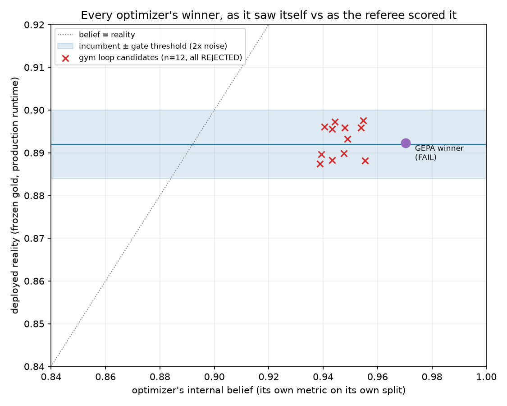

# Benchmark: extraction-gym loop vs DSPy GEPA, same referee

Two optimizers, one deterministic referee: the frozen, human-verified gold set v1
(42 real pages, residual label error 0.159 stated in MANIFEST.json), scored by the
gym's deterministic per-field scorers with value-critical weighting.

## Fairness contract

| dimension | gym loop | DSPy GEPA |
|---|---|---|
| starting prompt | root artifact ce68bd4c4e | same text, as signature instructions |
| model under test | gpt-4o-mini | gpt-4o-mini |
| frontier model | gpt-5.5 (mutation) | gpt-5.5 (reflection) |
| training signal | adversarial pressure suite only | same suite only (train/val split) |
| gold access during search | none (aggregate gate scores only) | none |
| referee | gym scorers on frozen gold v1 | identical |

## Results (three optimizers, one referee)



| configuration | internal belief | deployed gold (production) | vs root | gate verdict |
|---|---|---|---|---|
| root prompt, production runtime | - | **0.8920** | baseline | (incumbent) |
| root prompt, DSPy runtime | - | 0.8537 | -0.0383 | n/a (runtime tax) |
| gym loop best of 12 (run1) | 0.9553 (suite) | 0.8975 | +0.0055 | **FAIL** (all 12) |
| GEPA winner (light, 412 rollouts) | 0.9703 | 0.8923 | +0.0003 | **FAIL** (4 critical regressions) |
| MIPROv2 winner (light, demo-free) | 0.9513 | 0.8592 | **-0.0328** | **FAIL** (4 critical regressions) |

Fairness contract held for all three: same root prompt as the starting point, same model
under test (gpt-4o-mini), same frontier model (gpt-5.5) for mutation/reflection/proposal,
training signal from the adversarial pressure suite only, gold never visible to the
search, verdicts issued on the transplanted artifact in the production runtime.

MIPROv2 adds a pathology GEPA didn't show: instead of bloating (GEPA: 17,459 chars,
3.0x root), it COMPRESSED the prompt to 4,501 chars (0.73x root) and discarded guidance
the production task needs - a -3.3 point regression that its own metric scored 0.9513.
Opposite mutation styles, identical failure signature at the gate: coffee.variety and
price.listed_price regress in all three optimizers' winners.

## The three findings

**1. GEPA works on its own terms, and that is precisely the problem.** Within the DSPy
runtime, GEPA improved gold composite by +0.0217 over its own baseline, and its internal
selection metric rated its winning program 0.9703 on the pressure-suite split. Deployed
into the production runtime, that same winner scores 0.8923: +0.0003 over the incumbent,
a bootstrap CI of (-0.020, +0.018) that brackets zero, and four critical-field
regressions (page_type 0.976 -> 0.929, process_method 0.920 -> 0.875, variety
0.948 -> 0.875, package_grams 0.950 -> 0.925). GEPA's own acceptance criterion would
have shipped it; the gym's gate refuses it.

**2. The runtime is part of the program.** The identical root prompt scores 0.8920 in
the production runtime and 0.8537 through DSPy's adapter formatting: a -3.8 point
runtime tax that exceeds everything GEPA's optimization earned back (+2.2). An optimizer
that requires adopting its runtime must first pay for its runtime.

**3. Both optimizers fail the same honest exam, in the same way.** The gym's own loop
proposed 12 candidates; all improved or held the adversarial suite and all regressed
critical gold fields (variety, listed_price systematically). GEPA's winner shows the
same signature (variety, package_grams, process_method). Against a strong hand-written
root prompt, with a mini-class model under test, automated prompt search reliably finds
candidates that look better on the visible metric and silently break value-critical
fields on real pages. The scarce artifact is not a better search algorithm; it is a
referee that cannot be fooled: frozen human-verified gold, variance-aware thresholds,
critical-field regression blocking, and a prompt-length cap (GEPA's winner is 17,459
chars, 3.0x root; the gym gate would refuse it on length alone before reading a single
score).

## Gate sensitivity: the positive control

Every verdict above is a rejection, so: does the gate ever accept? Control experiment:
the root prompt was ablated along three axes the adversary demonstrably surfaces
(verbatim-variety, default-variant selection, blend guidance; artifact fd1a72082e,
gold 0.8571 = -3.5 points, ~9x noise band), then the identical loop ran against it.

Result (control1, strict protocol, $3.12): the loop's candidates recovered most of the
induced damage - best candidate 0.8954 on gold, ABOVE the un-ablated root - yet all 9
were rejected. Diagnosis, visible in the ledger: (a) suite dilution - acceptance requires
pressure-suite improvement, but the suite still carried 30+ root-era pages the control
already aces, so genuine recovery was averaged away (by design, gold is non-regression
only: you cannot climb ON the referee); (b) at n=42, one flipped page moves a field mean
by ~0.024, beyond most per-field bands, so single-page wobbles on non-ablated fields
block.

Control2 ($3.29) isolated (a) with a dedicated per-incumbent suite - and eliminated it as
the primary mechanism: even on pages generated exclusively against the control, the
incumbent's suite composite sits at ~0.97, because a "hit" breaks one or two weighted
fields out of ~29 and the page composite stays high. The +0.01 composite band leaves no
headroom on a small, mostly-correct suite regardless of purity. Control2's best candidate
scored 0.8995 on gold - the highest score of the entire project, above the healthy root's
0.8920 - and was rejected. 9 more candidates, 0 acceptances.

Consolidated sensitivity result: across 18 control candidates (both runs), the gate's
specificity remained perfect (nothing false shipped anywhere in this project) and its
sensitivity was zero - it refused genuine repairs, including two candidates that beat
the healthy root. The mechanism is fully characterized: acceptance is scored on suite
COMPOSITE, which dilutes targeted fixes across all fields of all pages; and per-field
gold bands at n=42 block on single-page quanta. The principled fix (gate v2, future
work, deliberately not applied mid-experiment): score candidates on incumbent-failure
fields specifically - of the fields the incumbent gets wrong on the suite, what fraction
does the candidate fix - keeping gold non-regression exactly as is. That preserves the
anti-Goodhart firewall (gold still never a training target) while giving recovery a
signal that composite averaging cannot wash out. Grow the gold set to loosen the
one-page quantum.

## Second adapter: SROIE receipts, and a measured label-error bound

To convert "the harness is task-agnostic" from claim to fact, a second adapter
(adapters/sroie) runs the same referee machinery on the most-cited key-information
benchmark: ICDAR-2019 SROIE receipts (347 official test receipts, 4 fields; data
checksum-pinned, never redistributed). Naive-prompt baselines: gpt-4o-mini 0.7776,
claude-haiku-4-5 0.8122 (normalized exact match, value-weighted).

The label audit is the standalone finding. Protocol: two prelabel models from different
provider families labeled every receipt blind; on a seeded 40-receipt sample (160
fields), 119 fields where both models matched the official label were auto-accepted and
41 disputes went to human arbitration. Result: 9 official-label errors confirmed, a
measured LOWER BOUND of 5.6% on SROIE official-label error - lower bound because the
119 auto-accepts were never human-read and both models saw SROIE in training, so their
agreement with an official label is partly recitation (contamination correlates the
votes in exactly the direction that hides errors). Errors found include a total of
'26:58' (colon for decimal point), a truncated company registration suffix, and an
address missing two printed lines. A second, separate noise species was characterized:
official labels that faithfully reproduce OCR errors (e.g. '(EDAI BUKU' where the
receipt image says 'KEDAI BUKU') - correct behavior for a text-channel benchmark, but
folklore counts it as label noise. And one methodological lesson worth its own line:
the audit's first run flagged apparent label errors that were actually OUR OWN
reconstruction bug (fixed-threshold line clustering scrambled high-resolution receipts)
- caught by verbatim-on-page checks before any claim was made. Audit the auditor first.

## Costs (audited)

Computed from recorded evidence, not estimates. (a) Every gym extraction call is cached
with exact token counts: 1,115 entries = $3.42 exact. (b) Budget-tracker ledger rows:
adversary rounds $1.44 + run1 loop $4.16 exact. (c) GEPA bounded worst-case (2x412
rollouts even though the second run replayed from disk cache, 4x42 gold evals, 40
reflection calls at 30k-in/8k-out gpt-5.5 pricing): $18.23 upper bound. Total, with
(a)/(b) overlaps deliberately double-counted: **$27.24 conservative upper bound against
the $80 cap** ($52.76 headroom). True spend is lower (overlap double-counting plus GEPA
cache replay).

## Reproduce

```text
gym eval ce68bd4c4e                # baseline
gym noise ce68bd4c4e --n 3         # noise band
gym loop --run-id run1 --target ce68bd4c4e --noise runs/noise-...json
gym gepa --root ce68bd4c4e --auto light
python scripts/gepa_transplant.py  # transplant + gated verdict
```
